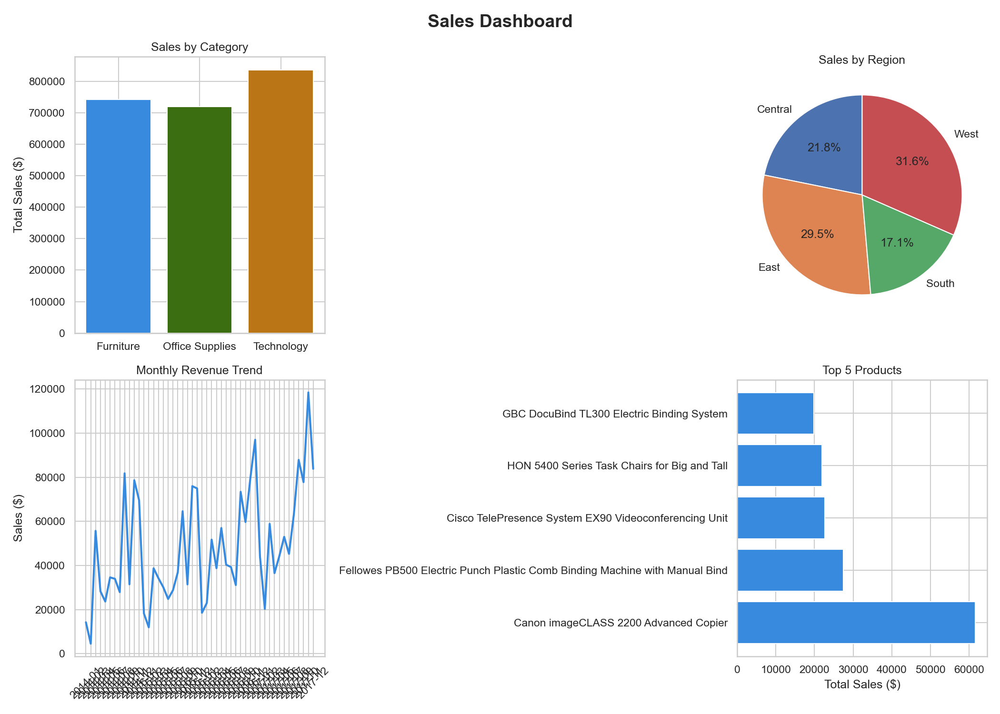

# Sales Dashboard — Python Data Analysis

## Project Overview
Analyzed the Sample Superstore dataset to uncover sales trends,
top products, and regional performance.

## Tools Used
- Python
- Pandas (data cleaning & analysis)
- Matplotlib & Seaborn (visualization)
- Jupyter Notebook (VS Code)

## Key Insights
- Technology category generated the highest sales
- West region contributed the most revenue
- Top product: Canon imageCLASS Copier

## Dashboard Preview

## Dataset
Sample Superstore Dataset from Kaggle
